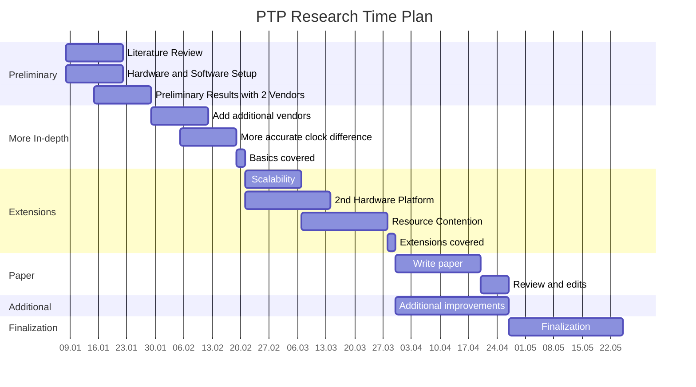

# PTP-Perf

A survey of PTP time-synchronization considerations. This work is conducted at the University of British Columbia.

### Project Plan

The survey project is structured into the following rough components: a preliminary stage for collecting initial measurements, and several extensions of the basics. 

_Note: This doesn't render correctly on GitHub yet because GitHub uses an old version of mermaid_

### Planned Experiments

We aim to collect data for the following experiments:

| Name                     | Description                                                                                      | Notes                                                                                                                                                                                       |
|--------------------------|--------------------------------------------------------------------------------------------------|---------------------------------------------------------------------------------------------------------------------------------------------------------------------------------------------|
| **Baseline**             | 1-1 Synchronization quality                                                                      | Potential Metrics:     Clock difference (synchronization quality)     Convergence time     Jitter (metric?)   Difference between reported clock offset and actual clock offset. |
| Resilience               | Measure relative performance when contention is present - CPU contention - Network contention | Contention can be generated e.g. using iPerf and perhaps with differing levels of intensity                                                                                                 |
| Unprioritized contention | Contention same interface & traffic  class                                                       |                                                                                                                                                                                             |
| Prioritized contention   | Contention on lower traffic class                                                                |                                                                                                                                                                                             |
| Isolated contention      | Contention on other interface                                                                    |                                                                                                                                                                                             |
| Scalability              | Synchronization across switch using more nodes                                                   | More hardware intensive, need compatible switch and access to more nodes                                                                                                                    |
_Experiments marked in bold are considered a priority._

### Literature
For a list of related works, see [here](literature.md).

### Vendors

PTP-Perf can currently collect metrics from 2 PTP time synchronization vendors: PTPd and LinuxPTP. PTPd is a general software implementation of the PTP protocol while LinuxPTP is tied specifically to the Linux kernel. The former is the easier of the two to deploy, however the better integration with the kernel and hardware of LinuxPTP promises better synchronization performance at the cost of some added complexity.

#### Additional Surveyed Vendors
PTP implementations exist both in software and hardware. For comparability reasons, we restrict ourselves to pure software implementations of PTP. Since typical use-cases that require accurate time-synchronization tend toward industrial applications, many solutions are distributed by vendors commercially and are not publicly available. We surveyed all the remaining publicly available solutions for feasibility of integration, totalling at just three (OpenPTP, PPSi, and TimeBeat). 

OpenPTP (https://github.com/stefanct/openptp) is an Open-Source implementation released in late 2009, that has however not received significant attention, with the last release published more than 10 years ago. The author appears to have since moved on to the commercial XR7 PTP stack, and the project can be considered defunct. We encountered difficulties during our attempt to set up a working copy of OpenPTP and subsequently abandoned efforts as we do not consider this implementation as relevant anymore.

PPSi (https://ohwr.org/project/ppsi) is an implementation of PTP by CERN and targets not only Linux but also embedded scenarios. Compared to OpenPTP, PPSi is in a much more mature state, with maintainers still active at the time of writing (2023). Aside from the PTP client itself, PPSi also ships with useful tools that PTP-Perf leverages for benchmark orchestration. Unfortunately, PPSi has also proven unusable in our evaluation, with the client crashing consistently due to buffer-overruns on our testbed. A bug report has been filed and is now pending.

Timebeat (https://www.timebeat.app) is the most recent addition among our surveyed vendors. While it is not open-source, the binaries are readily-available and a license is comparatively simple to obtain. However, Timebeat also relies on heavy-weight infrastructure (elasticsearch), without which it does not appear to function. Since we do not have an elasticsearch instance available on our testbed, Timebeat had to be excluded from the evaluation.
